# DENOISING DIFFUSION IMPLICIT MODELS

Jiaming Song, Chenlin Meng & Stefano Ermon

Stanford University

{tsong,chenlin,ermon}@cs.stanford.edu

## ABSTRACT

Denoising diffusion probabilistic models (DDPMs) have achieved high quality image generation without adversarial training, yet they require simulating a Markov chain for many steps in order to produce a sample. To accelerate sampling, we present denoising diffusion implicit models (DDIMs), a more efficient class of iterative implicit probabilistic models with the same training procedure as DDPMs. In DDPMs, the generative process is defined as the reverse of a particular Markovian diffusion process. We generalize DDPMs via a class of non-Markovian diffusion processes that lead to the same training objective. These non-Markovian processes can correspond to generative processes that are deterministic, giving rise to implicit models that produce high quality samples much faster. We empirically demonstrate that DDIMs can produce high quality samples 10× to 50× faster in terms of wall-clock time compared to DDPMs, allow us to trade off computation for sample quality, perform semantically meaningful image interpolation directly in the latent space, and reconstruct observations with very low error.

## 1 INTRODUCTION

Deep generative models have demonstrated the ability to produce high quality samples in many domains (Karras et al., 2020; van den Oord et al., 2016a). In terms of image generation, generative adversarial networks (GANs, Goodfellow et al. (2014)) currently exhibits higher sample quality than likelihood-based methods such as variational autoencoders (Kingma & Welling, 2013), autoregressive models (van den Oord et al., 2016b) and normalizing flows (Rezende & Mohamed, 2015; Dinh et al., 2016). However, GANs require very specific choices in optimization and architectures in order to stabilize training (Arjovsky et al., 2017; Gulrajani et al., 2017; Karras et al., 2018; Brock et al., 2018), and could fail to cover modes of the data distribution (Zhao et al., 2018).

Recent works on iterative generative models (Bengio et al., 2014), such as denoising diffusion probabilistic models (DDPM, Ho et al. (2020)) and noise conditional score networks (NCSN, Song & Ermon (2019)) have demonstrated the ability to produce samples comparable to that of GANs, without having to perform adversarial training. To achieve this, many denoising autoencoding models are trained to denoise samples corrupted by various levels of Gaussian noise. Samples are then produced by a Markov chain which, starting from white noise, progressively denoises it into an image. This generative Markov Chain process is either based on Langevin dynamics (Song & Ermon, 2019) or obtained by reversing a forward diffusion process that progressively turns an image into noise (Sohl-Dickstein et al., 2015).

A critical drawback of these models is that they require many iterations to produce a high quality sample. For DDPMs, this is because that the generative process (from noise to data) approximates the reverse of the forward diffusion process (from data to noise), which could have thousands of steps; iterating over all the steps is required to produce a single sample, which is much slower compared to GANs, which only needs one pass through a network. For example, it takes around 20 hours to sample 50k images of size 32 × 32 from a DDPM, but less than a minute to do so from a GAN on a Nvidia 2080 Ti GPU. This becomes more problematic for larger images as sampling 50k images of size 256 × 256 could take nearly 1000 hours on the same GPU.

To close this efficiency gap between DDPMs and GANs, we present denoising diffusion implicit models (DDIMs). DDIMs are implicit probabilistic models (Mohamed & Lakshminarayanan, 2016) and are closely related to DDPMs, in the sense that they are trained with the same objective function.

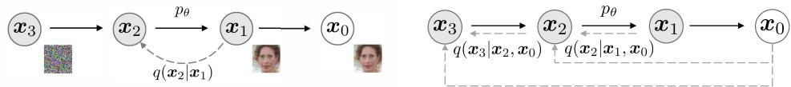  
Figure 1: Graphical models for diffusion (left) and non-Markovian (right) inference models.

In Section 3, we generalize the forward diffusion process used by DDPMs, which is Markovian, to non-Markovian ones, for which we are still able to design suitable reverse generative Markov chains. We show that the resulting variational training objectives have a shared surrogate objective, which is exactly the objective used to train DDPM. Therefore, we can freely choose from a large family of generative models using the same neural network simply by choosing a different, non-Markovian diffusion process (Section 4.1) and the corresponding reverse generative Markov Chain. In particular, we are able to use non-Markovian diffusion processes which lead to ”short” generative Markov chains (Section 4.2) that can be simulated in a small number of steps. This can massively increase sample efficiency only at a minor cost in sample quality.

In Section 5, we demonstrate several empirical benefits of DDIMs over DDPMs. First, DDIMs have superior sample generation quality compared to DDPMs, when we accelerate sampling by 10× to 100× using our proposed method. Second, DDIM samples have the following “consistency” property, which does not hold for DDPMs: if we start with the same initial latent variable and generate several samples with Markov chains of various lengths, these samples would have similar high-level features. Third, because of “consistency” in DDIMs, we can perform semantically meaningful image interpolation by manipulating the initial latent variable in DDIMs, unlike DDPMs which interpolates near the image space due to the stochastic generative process.

## 2 BACKGROUND

Given samples from a data distribution q(x0), we are interested in learning a model distribution pθ(x0) that approximates q(x0) and is easy to sample from. Denoising diffusion probabilistic models (DDPMs, Sohl-Dickstein et al. (2015); Ho et al. (2020)) are latent variable models of the form

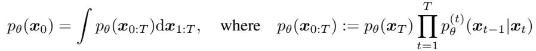

(1)

where x , . . . , x are latent variables in the same sample space as x (denoted as X). The parameters θ are learned to fit the data distribution q(x ) by maximizing a variational lower bound:

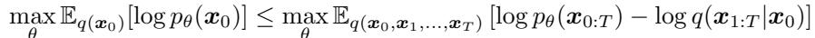

(2)

where q(x1:T|x0) is some inference distribution over the latent variables. Unlike typical latent variable models (such as the variational autoencoder (Rezende et al., 2014)), DDPMs are learned with a fixed (rather than trainable) inference procedure q(x |x ), and latent variables are relatively high dimensional. For example, Ho et al. (2020) considered the following Markov chain with Gaussian transitions parameterized by a decreasing sequence α1:T ∈ (0, 1]T:

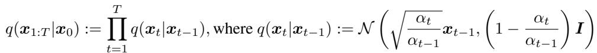

(3)

where the covariance matrix is ensured to have positive terms on its diagonal. This is called the forward process due to the autoregressive nature of the sampling procedure (from x to x ). We call the latent variable model pθ(x0:T), which is a Markov chain that samples from xT to x0, the generative process, since it approximates the intractable reverse process q(xt−1|xt). Intuitively, the forward process progressively adds noise to the observation x , whereas the generative process progressively denoises a noisy observation (Figure 1, left).

A special property of the forward process is that

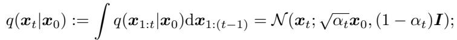

so we can express x as a linear combination of x and a noise variable :

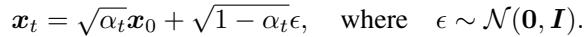

(4)

When we set αT sufficiently close to 0, q(xT|x0) converges to a standard Gaussian for all x0, so it is natural to set pθ(xT) := N (0, I). If all the conditionals are modeled as Gaussians with trainable mean functions and fixed variances, the objective in Eq. (2) can be simplified to1:

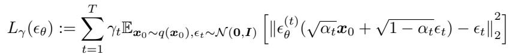

(5)

where θ := {(t)θ }Tt=1 is a set of T functions, each (t)θ : X → X (indexed by t) is a function with trainable parameters θ(t), and γ := [γ1, . . . , γT] is a vector of positive coefficients in the objective that depends on α . In Ho et al. (2020), the objective with γ = 1 is optimized instead to maximize generation performance of the trained model; this is also the same objective used in noise conditional score networks (Song & Ermon, 2019) based on score matching (Hyvarinen¨ , 2005; Vincent, 2011). From a trained model, x is sampled by first sampling x from the prior p (x ), and then sampling xt−1 from the generative processes iteratively.

The length T of the forward process is an important hyperparameter in DDPMs. From a variational perspective, a large T allows the reverse process to be close to a Gaussian (Sohl-Dickstein et al., 2015), so that the generative process modeled with Gaussian conditional distributions becomes a good approximation; this motivates the choice of large T values, such as T = 1000 in Ho et al. (2020). However, as all T iterations have to be performed sequentially, instead of in parallel, to obtain a sample x0, sampling from DDPMs is much slower than sampling from other deep generative models, which makes them impractical for tasks where compute is limited and latency is critical.

## 3 VARIATIONAL INFERENCE FOR NON-MARKOVIAN FORWARD PROCESSES

Because the generative model approximates the reverse of the inference process, we need to rethink the inference process in order to reduce the number of iterations required by the generative model. Our key observation is that the DDPM objective in the form of L only depends on the marginals2 q(x |x ), but not directly on the joint q(x |x ). Since there are many inference distributions (joints) with the same marginals, we explore alternative inference processes that are non-Markovian, which leads to new generative processes (Figure 1, right). These non-Markovian inference process lead to the same surrogate objective function as DDPM, as we will show below. In Appendix A, we show that the non-Markovian perspective also applies beyond the Gaussian case.

## 3.1 NON-MARKOVIAN FORWARD PROCESSES

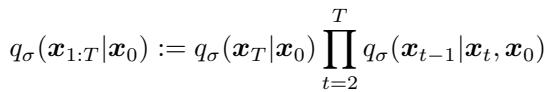

(6)

where qσ(xT|x0) = N (√αTx0, (1 − αT)I) and for all t > 1,

(7)

The mean function is chosen to order to ensure that qσ(xt|x0) = N (√αtx0, (1 − αt)I) for all t (see Lemma 1 of Appendix B), so that it defines a joint inference distribution that matches the “marginals” as desired. The forward process3 can be derived from Bayes’ rule:

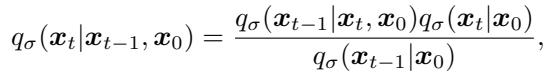

(8)

which is also Gaussian (although we do not use this fact for the remainder of this paper). Unlike the diffusion process in Eq. (3), the forward process here is no longer Markovian, since each xt could depend on both x − and x . The magnitude of σ controls the how stochastic the forward process is; when σ → 0, we reach an extreme case where as long as we observe x and x for some t, then xt−1 become known and fixed.

## 3.2 GENERATIVE PROCESS AND UNIFIED VARIATIONAL INFERENCE OBJECTIVE

edge of q (x |x , x ). Intuitively, given a noisy observation x , we first make a prediction4 of the corresponding x0, and then use it to obtain a sample xt−1 through the reverse conditional distribution qσ(xt−1|xt, x0), which we have defined.

attempts to predict t from xt, without knowledge of x0. By rewriting Eq. (4), one can then predict the denoised observation, which is a prediction of x0 given xt:

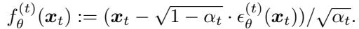

(9)

We can then define the generative process with a fixed prior pθ(xT) = N(0, I) and

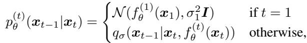

(10)

where qσ(xt−1|xt, f(t)(xt)) is defined as in Eq. (7) with x0 replaced by f(t)(xt). We add some Gaussian noise (with covariance σ2I) for the case of t = 1 to ensure that the generative process is supported everywhere.

We optimize θ via the following variational inference objective (which is a functional over θ):

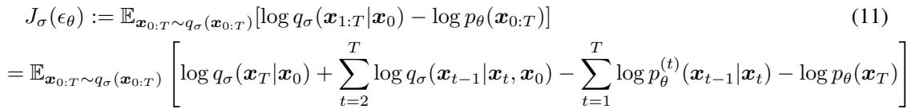

where we factorize qσ(x1:T|x0) according to Eq. (6) and pθ(x0:T) according to Eq. (1).

From the definition of J , it would appear that a different model has to be trained for every choice of σ, since it corresponds to a different variational objective (and a different generative process). However, J is equivalent to L for certain weights γ, as we show below.

Theorem 1. For all σ > 0, there exists γ ∈ RT and C ∈ R, such that Jσ = Lγ + C.

The variational objective Lγ is special in the sense that if parameters θ of the models  (t) are not shared across different t, then the optimal solution for  will not depend on the weights γ (as global optimum is achieved by separately maximizing each term in the sum). This property of Lγ has two implications. On the one hand, this justified the use of L1 as a surrogate objective function for the variational lower bound in DDPMs; on the other hand, since Jσ is equivalent to some Lγ from Theorem 1, the optimal solution of Jσ is also the same as that of L1. Therefore, if parameters are not shared across t in the model  , then the L objective used by Ho et al. (2020) can be used as a surrogate objective for the variational objective Jσ as well.

## 4 SAMPLING FROM GENERALIZED GENERATIVE PROCESSES

With L1 as the objective, we are not only learning a generative process for the Markovian inference process considered in Sohl-Dickstein et al. (2015) and Ho et al. (2020), but also generative processes for many non-Markovian forward processes parametrized by σ that we have described. Therefore, we can essentially use pretrained DDPM models as the solutions to the new objectives, and focus on finding a generative process that is better at producing samples subject to our needs by changing σ.

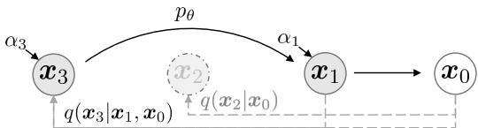  
Figure 2: Graphical model for accelerated generation, where τ = [1, 3].

## 4.1 DENOISING DIFFUSION IMPLICIT MODELS

From pθ(x1:T) in Eq. (10), one can generate a sample xt−1 from a sample xt via:

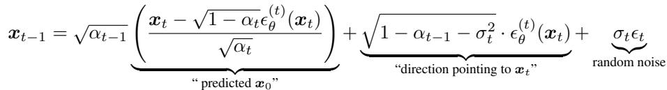

(12)

where  ∼ N(0, I) is standard Gaussian noise independent of x , and we define α := 1. Different choices of σ values results in different generative processes, all while using the same model  , so re-training the model is unnecessary. When σt = p(1 − αt−1)/(1 − αt)p1 − αt/αt−1 for all t, the forward process becomes Markovian, and the generative process becomes a DDPM.

We note another special case when σ = 0 for all t5; the forward process becomes deterministic given x and x , except for t = 1; in the generative process, the coefficient before the random noise  becomes zero. The resulting model becomes an implicit probabilistic model (Mohamed & Lakshminarayanan, 2016), where samples are generated from latent variables with a fixed procedure (from xT to x0). We name this the denoising diffusion implicit model (DDIM, pronounced /d:Im/), because it is an implicit probabilistic model trained with the DDPM objective (despite the forward process no longer being a diffusion).

## 4.2 ACCELERATED GENERATION PROCESSES

In the previous sections, the generative process is considered as the approximation to the reverse process; since of the forward process has T steps, the generative process is also forced to sample T steps. However, as the denoising objective L1 does not depend on the specific forward procedure as long as qσ(xt|x0) is fixed, we may also consider forward processes with lengths smaller than T, which accelerates the corresponding generative processes without having to train a different model.

Let us consider the forward process as defined not on all the latent variables x1:T, but on a subset {xτ , . . . , xτ }, where τ is an increasing sub-sequence of [1, . . . , T] of length S. In particular, we define the sequential forward process over xτ , . . . , xτ such that q(xτ |x0) = N (√ατ x0, (1 − ατ )I) matches the “marginals” (see Figure 2 for an illustration). The generative process now samples latent variables according to reversed(τ), which we term (sampling) trajectory. When the length of the sampling trajectory is much smaller than T, we may achieve significant increases in computational efficiency due to the iterative nature of the sampling process.

Using a similar argument as in Section 3, we can justify using the model trained with the L objective, so no changes are needed in training. We show that only slight changes to the updates in Eq. (12) are needed to obtain the new, faster generative processes, which applies to DDPM, DDIM, as well as all generative processes considered in Eq. (10). We include these details in Appendix C.1.

In principle, this means that we can train a model with an arbitrary number of forward steps but only sample from some of them in the generative process. Therefore, the trained model could consider many more steps than what is considered in (Ho et al., 2020) or even a continuous time variable t (Chen et al., 2020). We leave empirical investigations of this aspect as future work.

## 4.3 RELEVANCE TO NEURAL ODES

Moreover, we can rewrite the DDIM iterate according to Eq. (12), and its similarity to Euler integration for solving ordinary differential equations (ODEs) becomes more apparent:

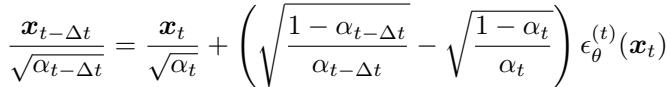

(13)

To derive the corresponding ODE, we can reparameterize (√1 − α/√α) with σ and (x/√α) with x¯. In the continuous case, σ and x are functions of t, where σ : R≥0 → R≥0 is continous, increasing with σ(0) = 0. Equation (13) with can be treated as a Euler method over the following ODE:

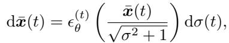

(14)

where the initial conditions is x(T) ∼ N(0, σ(T)) for a very large σ(T) (which corresponds to the case of α ≈ 0). This suggests that with enough discretization steps, the we can also reverse the generation process (going from t = 0 to T), which encodes x0 to xT and simulates the reverse of the ODE in Eq. (14). This suggests that unlike DDPM, we can use DDIM to obtain encodings of the observations (as the form of xT), which might be useful for other downstream applications that requires latent representations of a model.

In a concurrent work, (Song et al., 2020) proposed a “probability flow ODE” that aims to recover the marginal densities of a stochastic differential equation (SDE) based on scores, from which a similar sampling schedule can be obtained. Here, we state that the our ODE is equivalent to a special case of theirs (which corresponds to a continuous-time analog of DDPM).

Proposition 1. The ODE in Eq. (14) with the optimal model (t)θ has an equivalent probability flow ODE corresponding to the “Variance-Exploding” SDE in Song et al. (2020).

We include the proof in Appendix B. While the ODEs are equivalent, the sampling procedures are not, since the Euler method for the probability flow ODE will make the following update:

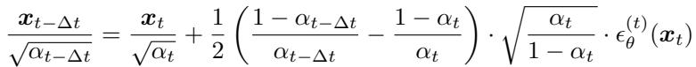

(15)

which is equivalent to ours if αt and αt−∆t are close enough. In fewer sampling steps, however, these choices will make a difference; we take Euler steps with respect to dσ(t) (which depends less directly on the scaling of “time” t) whereas Song et al. (2020) take Euler steps with respect to dt.

## 5 EXPERIMENTS

In this section, we show that DDIMs outperform DDPMs in terms of image generation when fewer iterations are considered, giving speed ups of 10× to 100× over the original DDPM generation process. Moreover, unlike DDPMs, once the initial latent variables x are fixed, DDIMs retain highlevel image features regardless of the generation trajectory, so they are able to perform interpolation directly from the latent space. DDIMs can also be used to encode samples that reconstruct them from the latent code, which DDPMs cannot do due to the stochastic sampling process.

For each dataset, we use the same trained model with T = 1000 and the objective being L from Eq. (5) with γ = 1; as we argued in Section 3, no changes are needed with regards to the training procedure. The only changes that we make is how we produce samples from the model; we achieve this by controlling τ (which controls how fast the samples are obtained) and σ (which interpolates between the deterministic DDIM and the stochastic DDPM).

We consider different sub-sequences τ of [1, . . . , T] and different variance hyperparameters σ indexed by elements of τ . To simplify comparisons, we consider σ with the form:

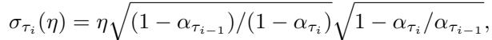

(16)

where η ∈ R is a hyperparameter that we can directly control. This includes an original DDPM generative process when η = 1 and DDIM when η = 0. We also consider DDPM where the random noise has a larger standard deviation than σ(1), which we denote as σˆ: σˆτ = p1 − ατ /ατ . This is used by the implementation in Ho et al. (2020) only to obtain the CIFAR10 samples, but not samples of the other datasets. We include more details in Appendix D.

Table 1: CIFAR10 and CelebA image generation measured in FID. η = 1.0 and σˆ are cases of DDPM (although Ho et al. (2020) only considered T = 1000 steps, and S < T can be seen as simulating DDPMs trained with S steps), and η = 0.0 indicates DDIM.  
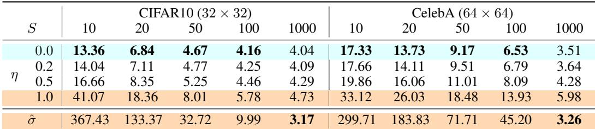

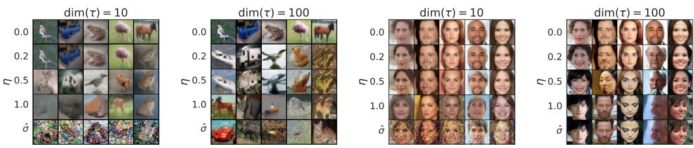  
Figure 3: CIFAR10 and CelebA samples with dim(τ ) = 10 and dim(τ ) = 100.

## 5.1 SAMPLE QUALITY AND EFFICIENCY

In Table 1, we report the quality of the generated samples with models trained on CIFAR10 and CelebA, as measured by Frechet Inception Distance (FID (Heusel et al., 2017)), where we vary the number of timesteps used to generate a sample (dim(τ)) and the stochasticity of the process (η). As expected, the sample quality becomes higher as we increase dim(τ ), presenting a tradeoff between sample quality and computational costs. We observe that DDIM (η = 0) achieves the best sample quality when dim(τ ) is small, and DDPM (η = 1 and σˆ) typically has worse sample quality compared to its less stochastic counterparts with the same dim(τ), except for the case for dim(τ) = 1000 and σˆ reported by Ho et al. (2020) where DDIM is marginally worse. However, the sample quality of σˆ becomes much worse for smaller dim(τ), which suggests that it is ill-suited for shorter trajectories. DDIM, on the other hand, achieves high sample quality much more consistently.

In Figure 3, we show CIFAR10 and CelebA samples with the same number of sampling steps and varying σ. For the DDPM, the sample quality deteriorates rapidly when the sampling trajectory has 10 steps. For the case of σˆ, the generated images seem to have more noisy perturbations under short trajectories; this explains why the FID scores are much worse than other methods, as FID is very sensitive to such perturbations (as discussed in Jolicoeur-Martineau et al. (2020)).

In Figure 4, we show that the amount of time needed to produce a sample scales linearly with the length of the sample trajectory. This suggests that DDIM is useful for producing samples more efficiently, as samples can be generated in much fewer steps. Notably, DDIM is able to produce samples with quality comparable to 1000 step models within 20 to 100 steps, which is a 10× to 50× speed up compared to the original DDPM. Even though DDPM could also achieve reasonable sample quality with 100× steps, DDIM requires much fewer steps to achieve this; on CelebA, the FID score of the 100 step DDPM is similar to that of the 20 step DDIM.

## 5.2 SAMPLE CONSISTENCY IN DDIMS

For DDIM, the generative process is deterministic, and x0 would depend only on the initial state xT. In Figure 5, we observe the generated images under different generative trajectories (i.e. different τ) while starting with the same initial x . Interestingly, for the generated images with the same initial x , most high-level features are similar, regardless of the generative trajectory. In many cases, samples generated with only 20 steps are already very similar to ones generated with 1000 steps in terms of high-level features, with only minor differences in details. Therefore, it would appear that x alone would be an informative latent encoding of the image; and minor details that affects sample quality are encoded in the parameters, as longer sample trajectories gives better quality samples but do not significantly affect the high-level features. We show more samples in Appendix D.4.

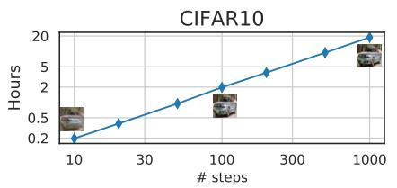

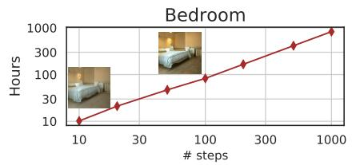  
Figure 4: Hours to sample 50k images with one Nvidia 2080 Ti GPU and samples at different steps.

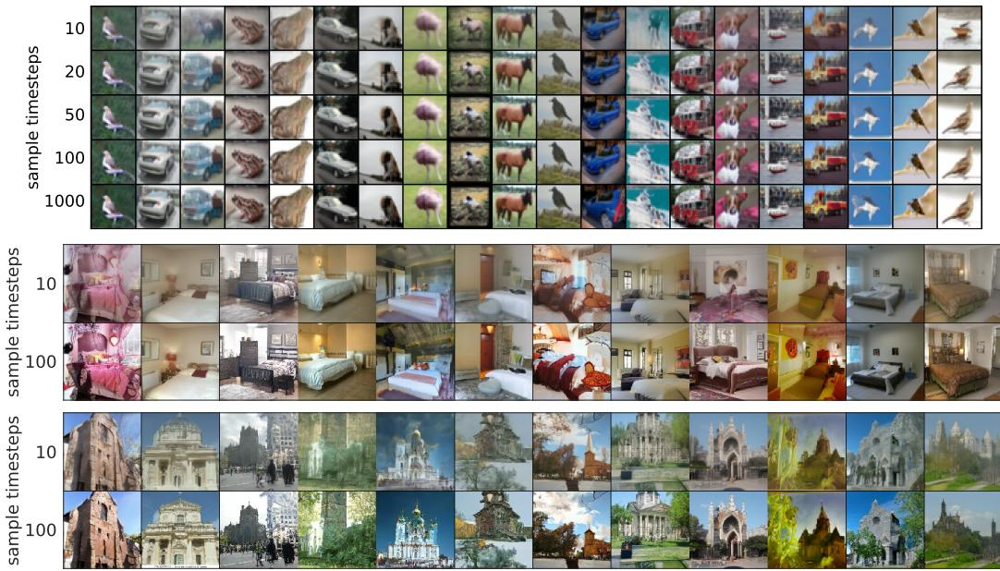  
Figure 5: Samples from DDIM with the same random xT and different number of steps.

## 5.3 INTERPOLATION IN DETERMINISTIC GENERATIVE PROCESSES

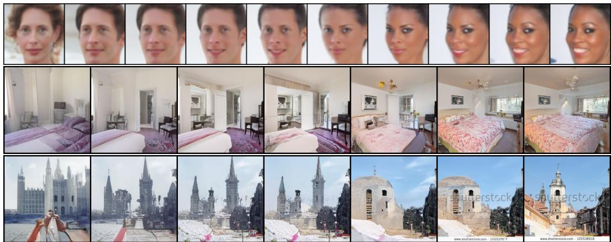  
Figure 6: Interpolation of samples from DDIM with dim(τ) = 50.

Since the high level features of the DDIM sample is encoded by x , we are interested to see whether it would exhibit the semantic interpolation effect similar to that observed in other implicit probabilistic models, such as GANs (Goodfellow et al., 2014). This is different from the interpolation procedure in Ho et al. (2020), since in DDPM the same x would lead to highly diverse x due to the stochastic generative process6. In Figure 6, we show that simple interpolations in x can lead to semantically meaningful interpolations between two samples. We include more details and samples in Appendix D.5. This allows DDIM to control the generated images on a high level directly through the latent variables, which DDPMs cannot.

Table 2: Reconstruction error with DDIM on CIFAR-10 test set, rounded to 10−4.  
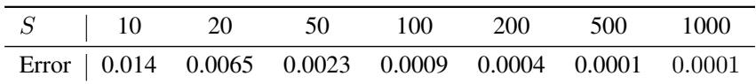

## 5.4 RECONSTRUCTION FROM LATENT SPACE

As DDIM is the Euler integration for a particular ODE, it would be interesting to see whether it can encode from x to x (reverse of Eq. (14)) and reconstruct x from the resulting x (forward of Eq. (14))7. We consider encoding and decoding on the CIFAR-10 test set with the CIFAR-10 model with S steps for both encoding and decoding; we report the per-dimension mean squared error (scaled to [0, 1]) in Table 2. Our results show that DDIMs have lower reconstruction error for larger S values and have properties similar to Neural ODEs and normalizing flows. The same cannot be said for DDPMs due to their stochastic nature.

## 6 RELATED WORK

Our work is based on a large family of existing methods on learning generative models as transition operators of Markov chains (Sohl-Dickstein et al., 2015; Bengio et al., 2014; Salimans et al., 2014; Song et al., 2017; Goyal et al., 2017; Levy et al., 2017). Among them, denoising diffusion probabilistic models (DDPMs, Ho et al. (2020)) and noise conditional score networks (NCSN, Song & Ermon (2019; 2020)) have recently achieved high sample quality comparable to GANs (Brock et al., 2018; Karras et al., 2018). DDPMs optimize a variational lower bound to the log-likelihood, whereas NCSNs optimize the score matching objective (Hyvarinen ¨ , 2005) over a nonparametric Parzen density estimator of the data (Vincent, 2011; Raphan & Simoncelli, 2011).

Despite their different motivations, DDPMs and NCSNs are closely related. Both use a denoising autoencoder objective for many noise levels, and both use a procedure similar to Langevin dynamics to produce samples (Neal et al., 2011). Since Langevin dynamics is a discretization of a gradient flow (Jordan et al., 1998), both DDPM and NCSN require many steps to achieve good sample quality. This aligns with the observation that DDPM and existing NCSN methods have trouble generating high-quality samples in a few iterations.

DDIM, on the other hand, is an implicit generative model (Mohamed & Lakshminarayanan, 2016) where samples are uniquely determined from the latent variables. Hence, DDIM has certain properties that resemble GANs (Goodfellow et al., 2014) and invertible flows (Dinh et al., 2016), such as the ability to produce semantically meaningful interpolations. We derive DDIM from a purely variational perspective, where the restrictions of Langevin dynamics are not relevant; this could partially explain why we are able to observe superior sample quality compared to DDPM under fewer iterations. The sampling procedure of DDIM is also reminiscent of neural networks with continuous depth (Chen et al., 2018; Grathwohl et al., 2018), since the samples it produces from the same latent variable have similar high-level visual features, regardless of the specific sample trajectory.

## 7 DISCUSSION

We have presented DDIMs – an implicit generative model trained with denoising auto-encoding / score matching objectives – from a purely variational perspective. DDIM is able to generate highquality samples much more efficiently than existing DDPMs and NCSNs, with the ability to perform meaningful interpolations from the latent space. The non-Markovian forward process presented here seems to suggest continuous forward processes other than Gaussian (which cannot be done in the original diffusion framework, since Gaussian is the only stable distribution with finite variance). We also demonstrated a discrete case with a multinomial forward process in Appendix A, and it would be interesting to investigate similar alternatives for other combinatorial structures.

Moreover, since the sampling procedure of DDIMs is similar to that of an neural ODE, it would be interesting to see if methods that decrease the discretization error in ODEs, including multistep methods such as Adams-Bashforth (Butcher & Goodwin, 2008), could be helpful for further improving sample quality in fewer steps (Queiruga et al., 2020). It is also relevant to investigate whether DDIMs exhibit other properties of existing implicit models (Bau et al., 2019).

## ACKNOWLEDGEMENTS

The authors would like to thank Yang Song and Shengjia Zhao for helpful discussions over the ideas, Kuno Kim for reviewing an earlier draft of the paper, and Sharvil Nanavati and Sophie Liu for identifying typos. This research was supported by NSF (#1651565, #1522054, #1733686), ONR (N00014-19-1-2145), AFOSR (FA9550-19-1-0024), and Amazon AWS.

## REFERENCES

Martin Arjovsky, Soumith Chintala, and Leon Bottou. Wasserstein GAN. ´ arXiv preprint arXiv:1701.07875, January 2017.

David Bau, Jun-Yan Zhu, Jonas Wulff, William Peebles, Hendrik Strobelt, Bolei Zhou, and Antonio Torralba. Seeing what a gan cannot generate. In Proceedings of the IEEE International Conference on Computer Vision, pp. 4502–4511, 2019.

Yoshua Bengio, Eric Laufer, Guillaume Alain, and Jason Yosinski. Deep generative stochastic networks trainable by backprop. In International Conference on Machine Learning, pp. 226–234, January 2014.

Christopher M Bishop. Pattern recognition and machine learning. springer, 2006.

Andrew Brock, Jeff Donahue, and Karen Simonyan. Large scale GAN training for high fidelity natural image synthesis. arXiv preprint arXiv:1809.11096, September 2018.

John Charles Butcher and Nicolette Goodwin. Numerical methods for ordinary differential equations, volume 2. Wiley Online Library, 2008.

Nanxin Chen, Yu Zhang, Heiga Zen, Ron J Weiss, Mohammad Norouzi, and William Chan. WaveGrad: Estimating gradients for waveform generation. arXiv preprint arXiv:2009.00713, September 2020.

Ricky T Q Chen, Yulia Rubanova, Jesse Bettencourt, and David Duvenaud. Neural ordinary differential equations. arXiv preprint arXiv:1806.07366, June 2018.

Laurent Dinh, Jascha Sohl-Dickstein, and Samy Bengio. Density estimation using real NVP. arXiv preprint arXiv:1605.08803, May 2016.

Ian Goodfellow, Jean Pouget-Abadie, Mehdi Mirza, Bing Xu, David Warde-Farley, Sherjil Ozair, Aaron Courville, and Yoshua Bengio. Generative adversarial nets. In Advances in neural information processing systems, pp. 2672–2680, 2014.

Anirudh Goyal, Nan Rosemary Ke, Surya Ganguli, and Yoshua Bengio. Variational walkback: Learning a transition operator as a stochastic recurrent net. In Advances in Neural Information Processing Systems, pp. 4392–4402, 2017.

Will Grathwohl, Ricky T Q Chen, Jesse Bettencourt, Ilya Sutskever, and David Duvenaud. FFJORD: Free-form continuous dynamics for scalable reversible generative models. arXiv preprint arXiv:1810.01367, October 2018.

Ishaan Gulrajani, Faruk Ahmed, Martin Arjovsky, Vincent Dumoulin, and Aaron C Courville. Improved training of wasserstein gans. In Advances in Neural Information Processing Systems, pp. 5769–5779, 2017.

Martin Heusel, Hubert Ramsauer, Thomas Unterthiner, Bernhard Nessler, and Sepp Hochreiter. GANs trained by a two Time-Scale update rule converge to a local nash equilibrium. arXiv preprint arXiv:1706.08500, June 2017.

Jonathan Ho, Ajay Jain, and Pieter Abbeel. Denoising diffusion probabilistic models. arXiv preprint arXiv:2006.11239, June 2020.

Aapo Hyvarinen. Estimation of Non-Normalized statistical models by score matching.¨ Journal of Machine Learning Researc h, 6:695–709, 2005.

Alexia Jolicoeur-Martineau, Remi Pich´ e-Taillefer, R´ emi Tachet des Combes, and Ioannis´ Mitliagkas. Adversarial score matching and improved sampling for image generation. September 2020.

Richard Jordan, David Kinderlehrer, and Felix Otto. The variational formulation of the fokker– planck equation. SIAMjournal on mathematical analysis, 29(1):1–17, 1998.

Tero Karras, Samuli Laine, and Timo Aila. A Style-Based generator architecture for generative adversarial networks. arXiv preprint arXiv:1812.04948, December 2018.

Tero Karras, Samuli Laine, Miika Aittala, Janne Hellsten, Jaakko Lehtinen, and Timo Aila. Analyz ing and improving the image quality of stylegan. In Proceedings of the IEEE/CVF Conference on Computer Vision and Pattern Recognition, pp. 8110–8119, 2020.

Diederik P Kingma and Max Welling. Auto-Encoding variational bayes. arXiv preprint arXiv:1312.6114v10, December 2013.

Daniel Levy, Matthew D Hoffman, and Jascha Sohl-Dickstein. Generalizing hamiltonian monte carlo with neural networks. arXiv preprint arXiv:1711.09268, 2017.

Shakir Mohamed and Balaji Lakshminarayanan. Learning in implicit generative models. arXiv preprint arXiv:1610.03483, October 2016.

Radford M Neal et al. Mcmc using hamiltonian dynamics. Handbook of markov chain monte carlo, 2(11):2, 2011.

Alejandro F Queiruga, N Benjamin Erichson, Dane Taylor, and Michael W Mahoney. Continuousin-depth neural networks. arXiv preprint arXiv:2008.02389, 2020.

Martin Raphan and Eero P Simoncelli. Least squares estimation without priors or supervision. Neural computation, 23(2):374–420, February 2011. ISSN 0899-7667, 1530-888X.

Danilo Jimenez Rezende and Shakir Mohamed. Variational inference with normalizing flows. arXiv preprint arXiv:1505.05770, May 2015.

Danilo Jimenez Rezende, Shakir Mohamed, and Daan Wierstra. Stochastic backpropagation and approximate inference in deep generative models. arXiv preprint arXiv:1401.4082, 2014.

Olaf Ronneberger, Philipp Fischer, and Thomas Brox. U-net: Convolutional networks for biomedical image segmentation. In International Conference on Medical image computing and computer assisted intervention, pp. 234–241. Springer, 2015.

Tim Salimans, Diederik P Kingma, and Max Welling. Markov chain monte carlo and variational inference: Bridging the gap. arXiv preprint arXiv:1410.6460, October 2014.

Ken Shoemake. Animating rotation with quaternion curves. In Proceedings of the 12th annual conference on Computer graphics and interactive techniques, pp. 245–254, 1985.

Jascha Sohl-Dickstein, Eric A Weiss, Niru Maheswaranathan, and Surya Ganguli. Deep unsupervised learning using nonequilibrium thermodynamics. arXiv preprint arXiv:1503.03585, March 2015.

Jiaming Song, Shengjia Zhao, and Stefano Ermon. A-nice-mc: Adversarial training for mcmc. arXiv preprint arXiv:1706.07561, June 2017.

Yang Song and Stefano Ermon. Generative modeling by estimating gradients of the data distribution. arXiv preprint arXiv:1907.05600, July 2019.

Yang Song and Stefano Ermon. Improved techniques for training Score-Based generative models. arXiv preprint arXiv:2006.09011, June 2020.

Yang Song, Jascha Sohl-Dickstein, Diederik P Kingma, Abhishek Kumar, Stefano Ermon, and Ben Poole. Score-based generative modeling through stochastic differential equations. arXiv preprint arXiv:2011.13456, 2020.

Aaron van den Oord, Sander Dieleman, Heiga Zen, Karen Simonyan, Oriol Vinyals, Alex Graves, Nal Kalchbrenner, Andrew Senior, and Koray Kavukcuoglu. WaveNet: A generative model for raw audio. arXiv preprint arXiv:1609.03499, September 2016a.

Aaron van den Oord, Nal Kalchbrenner, and Koray Kavukcuoglu. Pixel recurrent neural networks. arXiv preprint arXiv:1601.06759, January 2016b.

Pascal Vincent. A connection between score matching and denoising autoencoders. Neural computation, 23(7):1661–1674, 2011.

Sergey Zagoruyko and Nikos Komodakis. Wide residual networks. arXiv preprint arXiv:1605.07146, May 2016.

Shengjia Zhao, Hongyu Ren, Arianna Yuan, Jiaming Song, Noah Goodman, and Stefano Ermon. Bias and generalization in deep generative models: An empirical study. In Advances in Neural Information Processing Systems, pp. 10792–10801, 2018.

## A NON-MARKOVIAN FORWARD PROCESSES FOR A DISCRETE CASE

In this section, we describe a non-Markovian forward processes for discrete data and corresponding variational objectives. Since the focus of this paper is to accelerate reverse models corresponding to the Gaussian diffusion, we leave empirical evaluations as future work.

For a categorical observation x that is a one-hot vector with K possible values, we define the forward process as follows. First, we have q(xt|x0) as the following categorical distribution:

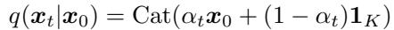

(17)

where 1K ∈ RK is a vector with all entries being 1/K, and αt decreasing from α0 = 1 for t = 0 to αT = 0 for t = T. Then we define q(xt−1|xt, x0) as the following mixture distribution:

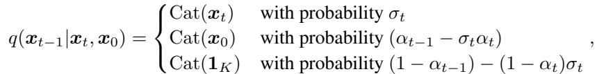

(18)

or equivalently:

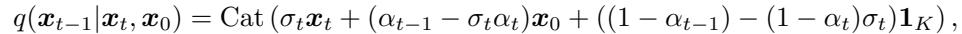

(19)

which is consistent with how we have defined q(xt|x0).

Similarly, we can define our reverse process pθ(xt−1|xt) as:

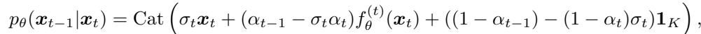

(20)

where f(t)(xt) maps xt to a K-dimensional vector. As (1 − αt−1) − (1 − αt)σt → 0, the sampling process will become less stochastic, in the sense that it will either choose xt or the predicted x0 with high probability. The KL divergence

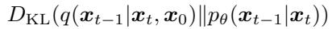

(21)

is well-defined, and is simply the KL divergence between two categoricals. Therefore, the resulting variational objective function should be easy to optimize as well. Moreover, as KL divergence is convex, we have this upper bound (which is tight when the right hand side goes to zero):

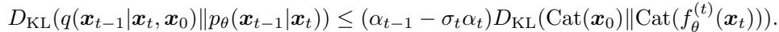

The right hand side is simply a multi-class classification loss (up to constants), so we can arrive at similar arguments regarding how changes in σt do not affect the objective (up to re-weighting).

## B PROOFS

Lemma 1. For qσ(x1:T|x0) defined in Eq. (6) and qσ(xt−1|xt, x0) defined in Eq. (7), we have:

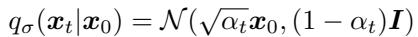

(22)

Proof. Assume for any t ≤ T, qσ(xt|x0) = N (√αtx0, (1 − αt)I) holds, if:

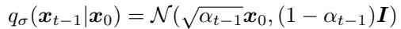

(23)

then we can prove the statement with an induction argument for t from T to 1, since the base case (t = T) already holds.

First, we have that

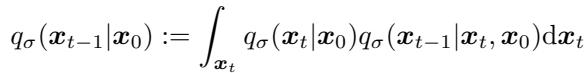

and

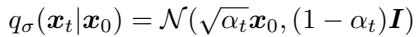

(24)

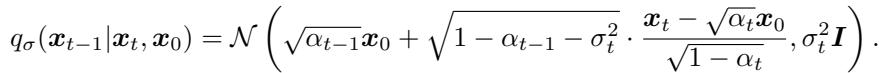

(25)

From Bishop (2006) (2.115), we have that qσ(xt−1|x0) is Gaussian, denoted as N (µt−1, Σt−1) where

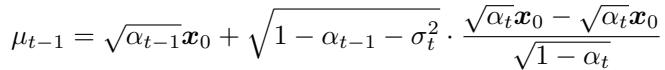

(26)

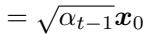

(27)

and

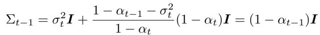

(28)

Therefore, qσ(xt−1|x0) = N (√αt−1x0, (1 − αt−1)I), which allows us to apply the induction argument. □

Theorem 1. For all σ > 0, there exists γ ∈ RT and C ∈ R, such that Jσ = Lγ + C.

Proof. From the definition of Jσ:

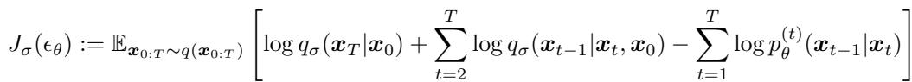

(29)

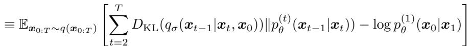

where we use ≡ to denote “equal up to a value that does not depend on θ (but may depend on qσ)”. For t > 1:

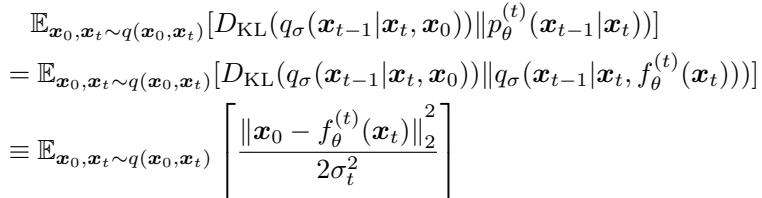

(30)

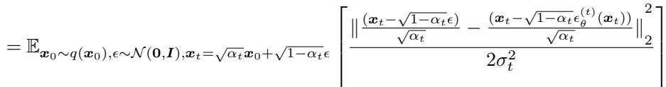

(31)

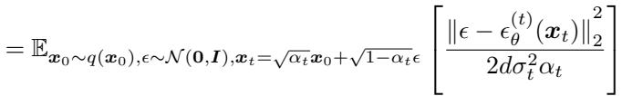

(32)

where d is the dimension of x0. For t = 1:

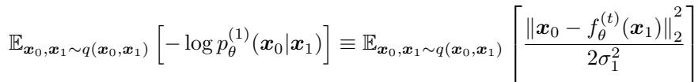

(33)

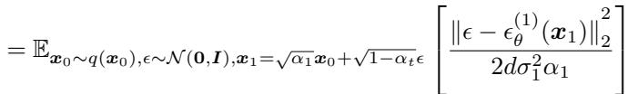

(34)

Therefore, when γt = 1/(2dσ2αt) for all t ∈ {1, . . . , T}, we have

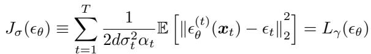

(35)

for all θ. From the definition of “≡”, we have that Jσ = Lγ + C.

ODE corresponding to the “Variance-Exploding” SDE in Song et al. (2020).

Proof. In the context of the proof, we consider t as a continous, independent “time” variable and x and α as functions of t. First, let us consider a reparametrization between DDIM and the VE-SDE8 by introducing the variables x¯ and σ:

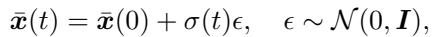

(36)

for t ∈ [0, ∞) and an increasing continuous function σ : R≥0 → R≥0 where σ(0) = 0.

We can then define α(t) and x(t) corresponding to DDIM case as:

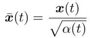

(37)

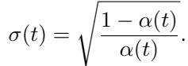

(38)

This also means that:

(39)

(40)

which establishes an bijection between (x, α) and (x¯, σ). From Equation (4) we have (note that α(0) = 1):

(41)

which can be reparametrized into a form that is consistent with VE-SDE:

(42)

Now, we derive the ODE forms for both DDIM and VE-SDE and show that they are equivalent.

ODE form for DDIM We repeat Equation (13) here:

(43)

which is equivalent to:

(44)

Divide both sides by (−∆t) and as ∆t → 0, we have:

(45)

which is exactly what we have in Equation (14).

We note that for the optimal model,  (t) is a minimizer:

(46)

where x(t) = pα(t)x(t) + p1 − α(t).

ODE form for VE-SDE Define p (x¯) as the data distribution perturbed with σ2(t) variance Gaussian noise. The probability flow for VE-SDE is defined as Song et al. (2020):

(47)

where g(t) = q dσ2(t) is the diffusion coefficient, and ∇x¯ log pt(x¯) is the score of pt.

The σ(t)-perturbed score function ∇x¯ log pt(x¯) is also a minimizer (from denoising score matching (Vincent, 2011)):

(48)

where x¯(t) = x¯(t) + σ(t).

Since there is an equivalence between x(t) and x¯(t), we have the following relationship:

(49)

from Equation (46) and Equation (48). Plug Equation (49) and definition of g(t) in Equation (47), we have:

(50)

and we have the following by rearranging terms:

(51)

which is equivalent to Equation (45). In both cases the initial conditions are x¯(T) ∼ N (0, σ2(T)I), so the resulting ODEs are identical. □

## C ADDITIONAL DERIVATIONS

## C.1 ACCELERATED SAMPLING PROCESSES

In the accelerated case, we can consider the inference process to be factored as:

(52)

where τ is a sub-sequence of [1, . . . , T] of length S with τS = T, and let τ¯ := {1, . . . , T} \ τ be its complement. Intuitively, the graphical model of {xτ }Si=1 and x0 form a chain, whereas the graphical model of {xt}t∈τ¯ and x0 forms a star graph. We define:

(53)

where the coefficients are chosen such that:

(54)

i.e., the “marginals” match.

The corresponding “generative process” is defined as:

(55)

where only part of the models are actually being used to produce samples. The conditionals are:

(56)

(57)

where we leverage qσ,τ(xτ |xτ , x0) as part of the inference process (similar to what we have done in Section 3). The resulting variational objective becomes (define xτ = ∅ for conciseness):

(58)

(59)

where each KL divergence is between two Gaussians with variance independent of θ. A similar argument to the proof used in Theorem 1 can show that the variational objective J can also be converted to an objective of the form L .

## C.2 DERIVATION OF DENOISING OBJECTIVES FOR DDPMS

We note that in Ho et al. (2020), a diffusion hyperparameter βt9 is first introduced, and then relevant α to represent the variable α¯ in Ho et al. (2020) for three reasons. First, it makes it more clear that we only need to choose one set of hyperparameters, reducing possible cross-references of the derived variables. Second, it allows us to introduce the generalization as well as the acceleration case easier, because the inference process is no longer motivated by a diffusion. Third, there exists an isomorphism between α1:T and 1, . . . , T, which is not the case for βt.

In this section, we use βt and αt to be more consistent with the derivation in Ho et al. (2020), where

(60)

(61)

can be uniquely determined from αt (i.e. α¯t).

First, from the diffusion forward process:

Ho et al. (2020) considered a specific type of p(t)θ (xt−1|xt):

(62)

which leads to the following variational objective:

(63)

One can write:

(64)

Ho et al. (2020) chose the parametrization

(65)

which can be simplified to:

(66)

## D EXPERIMENTAL DETAILS

## D.1 DATASETS AND ARCHITECTURES

We consider 4 image datasets with various resolutions: CIFAR10 (32 × 32, unconditional), CelebA (64 × 64), LSUN Bedroom (256 × 256) and LSUN Church (256 × 256). For all datasets, we set the hyperparameters α according to the heuristic in (Ho et al., 2020) to make the results directly comparable. We use the same model for each dataset, and only compare the performance of different generative processes. For CIFAR10, Bedroom and Church, we obtain the pretrained checkpoints from the original DDPM implementation; for CelebA, we trained our own model using the denoising objective L1.

Our architecture for  (t) (xt) follows that in Ho et al. (2020), which is a U-Net (Ronneberger et al., 2015) based on a Wide ResNet (Zagoruyko & Komodakis, 2016). We use the pretrained models from Ho et al. (2020) for CIFAR10, Bedroom and Church, and train our own model for the CelebA 64 × 64 model (since a pretrained model is not provided). Our CelebA model has five feature map resolutions from 64 × 64 to 4 × 4, and we use the original CelebA dataset (not CelebA-HQ) using the pre-processing technique from the StyleGAN (Karras et al., 2018) repository.

Table 3: LSUN Bedroom and Church image generation results, measured in FID. For 1000 steps DDPM, the FIDs are 6.36 for Bedroom and 7.89 for Church.  

## D.2 REVERSE PROCESS SUB-SEQUENCE SELECTION

We consider two types of selection procedure for τ given the desired dim(τ ) < T:

• Linear: we select the timesteps such that τi = bcic for some c;

• Quadratic: we select the timesteps such that τi = bci2c for some c.

The constant value c is selected such that τ is close to T. We used quadratic for CIFAR10 and linear for the remaining datasets. These choices achieve slightly better FID than their alternatives in the respective datasets.

## D.3 CLOSED FORM EQUATIONS FOR EACH SAMPLING STEP

From the general sampling equation in Eq. (12), we have the following update equation:

  
Figure 7: CIFAR10 samples from 1000 step DDPM, 1000 step DDIM and 100 step DDIM.

where

For the case of σˆ (DDPM with a larger variance), the update equation becomes:

which uses a different coefficient for  compared with the update for η = 1, but uses the same coefficient for the non-stochastic parts. This update is more stochastic than the update for η = 1, which explains why it achieves worse performance when dim(τ) is small.

## D.4 SAMPLES AND CONSISTENCY

We show more samples in Figure 7 (CIFAR10), Figure 8 (CelebA), Figure 10 (Church) and consistency results of DDIM in Figure 9 (CelebA).

## D.5 INTERPOLATION

To generate interpolations on a line, we randomly sample two initial xT values from the standard Gaussian, interpolate them with spherical linear interpolation (Shoemake, 1985), and then use the DDIM to obtain x0 samples.

(67)

(x(0)T )>x(1)T (1) where θ = arccos kx(0)T kkx(1)T k These values are used to produce DDIM samples.

To generate interpolations on a grid, we sample four latent variables and separate them in to two pairs; then we use slerp with the pairs under the same α, and use slerp over the interpolated samples across the pairs (under an independently chosen interpolation coefficient). We show more grid interpolation results in Figure 11 (CelebA), Figure 12 (Bedroom), and Figure 13 (Church).

  
Figure 8: CelebA samples from 1000 step DDPM, 1000 step DDIM and 100 step DDIM.

  
Figure 9: CelebA samples from DDIM with the same random xT and different number of steps.

  
Figure 10: Church samples from 100 step DDPM and 100 step DDIM.

  
Figure 11: More interpolations from the CelebA DDIM with dim(τ ) = 50.

  
Figure 12: More interpolations from the Bedroom DDIM with dim(τ ) = 50.

  
Figure 13: More interpolations from the Church DDIM with dim(τ) = 50.